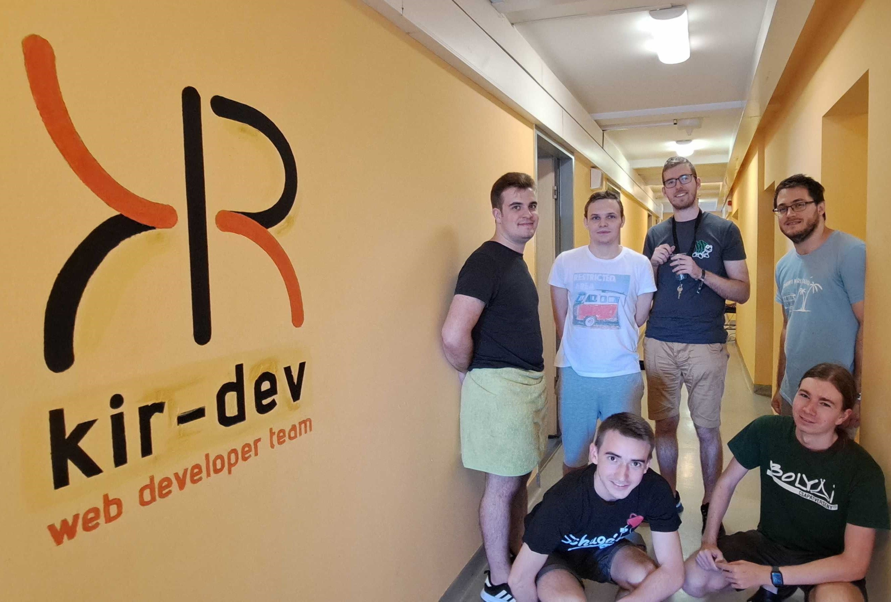

## Mi az a szintfestés?

A szintfestés a Schönherz közéletének egy nagyon fontos része: ez egy olyan alkalom, ahol a kollégium lakói mindannyian festhetnek a szintjük falára logókat vagy bármilyen vicces, funky ábrákat. (Bizonyos határokon belül.)

Ezek az alkotások generációkon át díszítik a Schönherz belsejét, amíg újra nem festik az egész szintet, helyet adva újabb lehetőségeknek.

## 2022 őszi szintfestés

Idén a szintfestés alól a Schönherz 13. emelete, a Simonyi Károly Szakkollégium szintje se maradhatott ki. Még egészen sok üres hely volt a falakon, így már igazán itt volt az ideje, hogy színesebbé tegyük a folyosókat.

A Kir-Dev csapata is részt vett ebben. Még a szintfestés napja előtt megterveztünk és felrajzoltuk a kör logójának körvonalát, majd a várva várt napot egy kellemes délutánt töltöttek tagjaink a festegetéssel. Ugyan nem a festés az erősségünk, mégis sikerült egy csodálatos logót alkotnunk, ráadásul jövőre is vannak már elképzeléseink, hogy a logó köré miket szeretnénk festeni.
Eddig még soha nem volt Kir-Dev logó festve a szakkoli szintjén, úgyhogy már nagyon itt volt az ideje.

Viszont a tagjaink tevékenysége a logónk befejeztével se maradt abba, ugyanis egy másik logó is nagyon hiányzott már a szintről, mégpedig a szakkollégium logója. A Simonyi sok köréből érkeztek lelkes emberek, és közös erővel megalkottuk a gyönyörű Simonyi logót is. Ha valaki a 13. szintre érkezik, most már egyből tudni fogja, hogy jó helyen jár.

