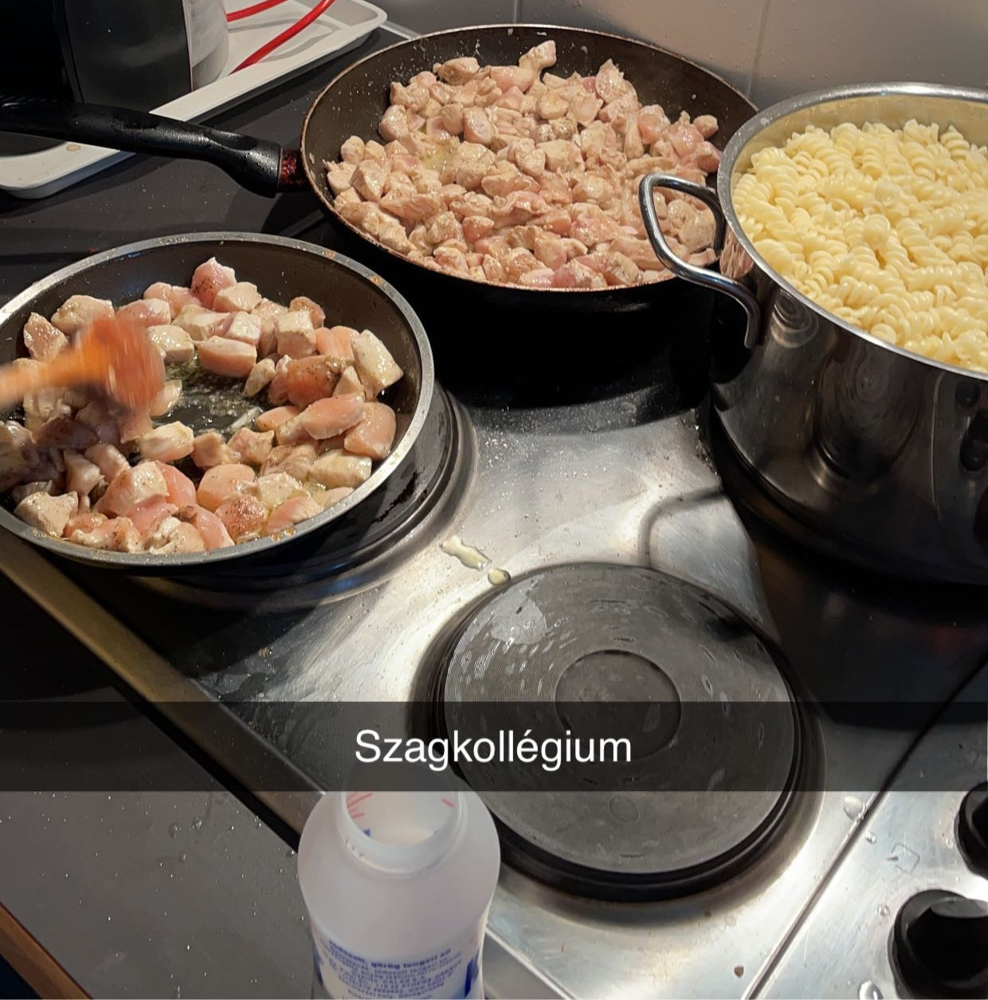
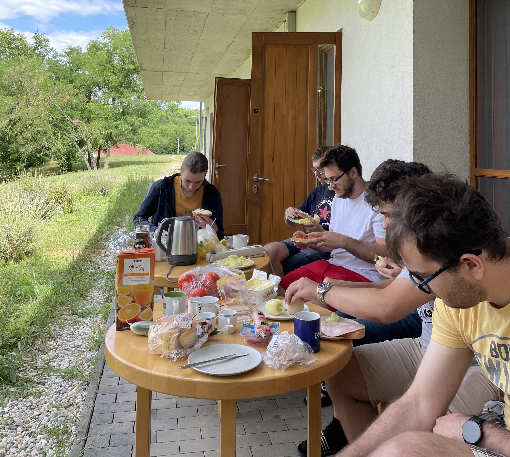
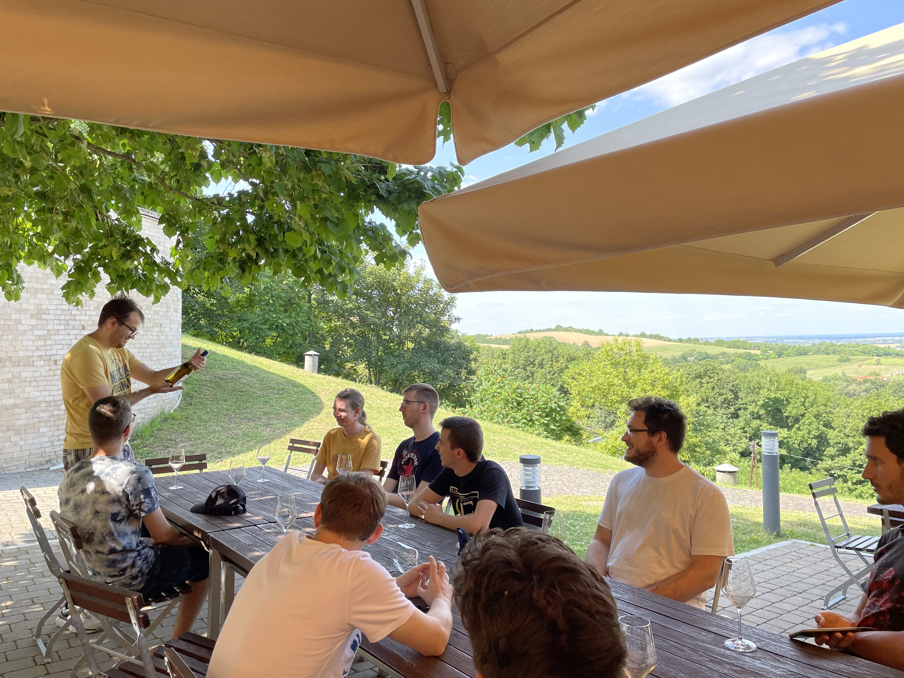
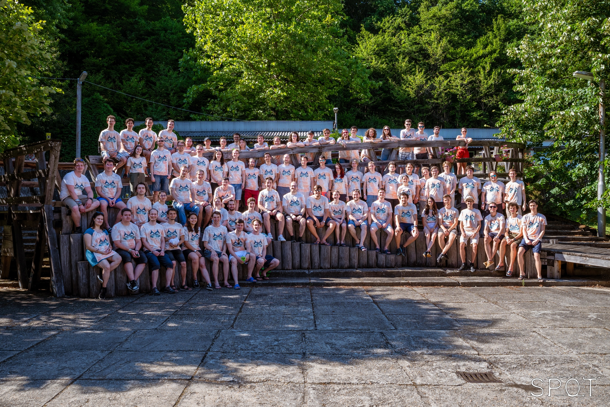
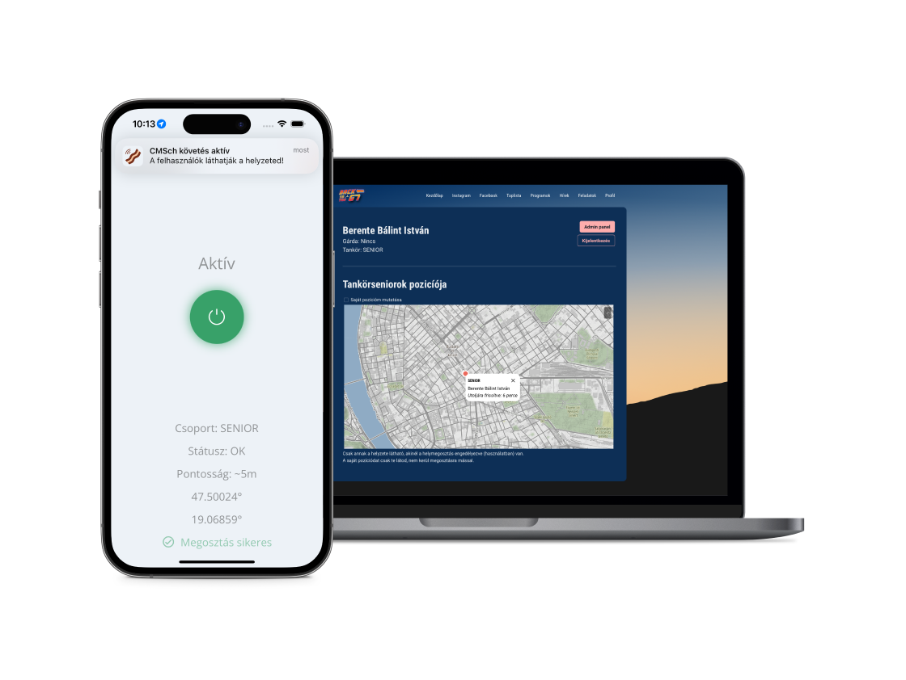

# 2023 nyár

## Tábor
Nyári táboraink mindig különlegesek és emlékezetesek szoktak lenni. Idén sem volt ez másként, amikor a Kir-Dev csapat 10 tagja júliusban összegyűlt Pannonhalmán egy fantasztikus htvégét eltölteni.

### Érkezés
A szállás, amit választottunk, a Pannonhalmi Főapátság Szent Jakab Vendégháza volt, egy teljesen új komplexum, ami minden szempontból megfelelt az igényeinknek. A kényelmes szobák és a barátságos légkör hamar otthonossá tette az egész helyet.

### A Gasztronómiai Élmények
Már az első este elkezdtük a kulináris utazást, amikor a tábor kuktái (minendki) felajánlották, hogy elkészíti a vacsorát.
A menüben szerepelt a híres tejszínes csirkés tészta, amit mindenki imádott.
Így már az étkezések is összekovácsoltak minket, és együtt tölthettünk el kellemes estéket a kertben.
A reggeli is pompás volt, a szállás terasz szerűségén gyűltek össze a táborozók és egy kiadós lakomát tartottak a túra előtt.

### Ride 'n' Wine
Közös kirándulásunk az apátságba különleges élmény volt.
A Pannonhalmi Bencés Főapátság impozáns épületegyüttese gyönyörű környezetben található, és a történelme is lenyűgöző.
Az apátság környékének minden szegletét bejárva a csapat lelkiekben már a délutáni borkostolóra készült.
A helyi borászatok kiváló borai mellett a társaság is remek volt, így a borok mellett a hangulat is fokozódott.
A nap végén a vacsorát megejtve folytatódott a szeszkultúra egy kis társasjátékkal fűszerezve.

## Simonyi Nyári Tábor
A szakkollégium életében kiemelt fontosságú az SNYT, azaz a Simonyi Nyári Tábor. Körünk idén is nagy kedvvel vett részt a rendezvényen, ahol a szakkollégiumi élet minden aspektusával megismerkedhettünk.
A szervezőknek ezúton is köszönjük a lehetőséget!

## Nyári Munka

Körünk szokásos nyári tevékenységei vették kezdetüket. A Gólyatábor, Gólyahét és Qpa közeledte már éreztette hatását.

### CMSch

A CMSch projekt az említett rendezvények közeledtével ismét előre kapott.
A kör tagjai a nyári hónapokban is folyamatosan dolgoztak a rendszeren, hogy a felhasználók számára a lehető legjobb élményt nyújtsa a későbbiekben.
A rendezvények azóta lementek sikeresen, sok tapasztalattal és egy még stabilabb rendszerrel gazdagodtunk.

### B(e)acon - CMSch Tracker mobilapp

A nyáron egy új irányzatot is elővettünk a fiókból: a mobilapp fejlesztést.
A cél az volt, hogy a Gólyahéten a gólyák követni tudják a tankörseniorjaikat, ezáltal a tankörüket, valamint, hogy a rendezők is követni tudják a tankörök mozgását.
A fejlesztés során a React Native keretrendszert használtuk, amelynek köszönhetően a kódunkat Androidra és iOS-re ki tudtuk adni TestFlight és PlayStore béta segítségével.
Több száz felhasználóhoz jutott el az alkalmazás.

## Valami véget ér, valami csak most kezdődik

A nyár végére a csapat már teljes erőbedobással készült a következő félévre, amikor ismét együtt dolgozhatunk a kör fejlődésén.
Izgalmas félév lesz, hiszen rengeteg új tag áll a felvételi előtt!
